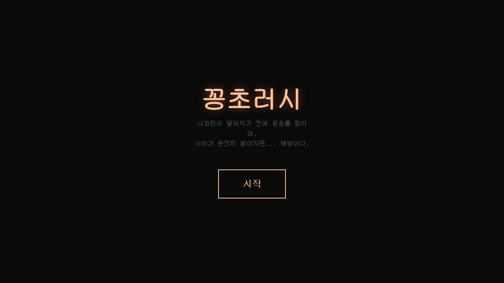
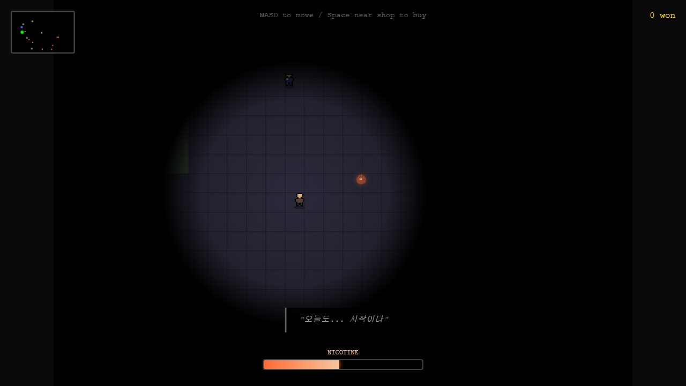

# 꽁초 러시

길바닥에서 꽁초를 줍는 생존 게임.

**[플레이하기](https://ggongcho-rush.vercel.app/)**

## 컨셉

돈 없는 니코틴 중독자가 되어 거리에서 꽁초를 주워 금단 증상을 버틴다. 니코틴 게이지가 0%면 금단으로 쓰러지고, 100%에 도달하면 "해방"된다. 해방의 의미는 플레이어가 직접 확인해야 한다.

레퍼런스는 Limbo/Inside(분위기), Darkwood(시야 시스템), Papers Please(생존 긴장감).

## 설계

**시야 = 체력.** 니코틴이 떨어지면 시야가 좁아지고, 20% 이하에서는 시야가 깜빡인다. 단순한 HP 바 대신 플레이어가 체감으로 위기를 느끼게 만든 구조.

**NPC 생태계.** 직장인, 술취한 사람, 학생은 각각 다른 속도로 담배를 피우고 다른 품질의 꽁초를 남긴다. 베이퍼는 연기만 뿜고 꽁초를 남기지 않는 함정 NPC. 경쟁자 노숙인은 같은 꽁초를 노린다. 경찰은 편의점 근처를 순찰하며 잡히면 체포 엔딩.

**날씨 이벤트.** 비가 오면 꽁초가 젖어서 못 쓰고, 러시아워에는 꽁초가 쏟아진다. 랜덤 이벤트가 전략적 판단을 요구한다.

**심리 연출.** 니코틴이 바닥나면 이토 준지 스타일의 공포 이펙트(나선 눈동자, 손)가 화면을 채운다. 캐릭터는 떨림, 땀방울, 말줄임표로 절박함을 표현한다.

## 엔딩

| 조건 | 결과 |
|------|------|
| 니코틴 0% | 금단 — 쓰러짐 |
| 경찰에 체포 | 체포 — 사이렌 |
| 니코틴 100% | 해방 — "드디어 보인다. 그리고 이제, 더 이상 볼 필요가 없다." |
